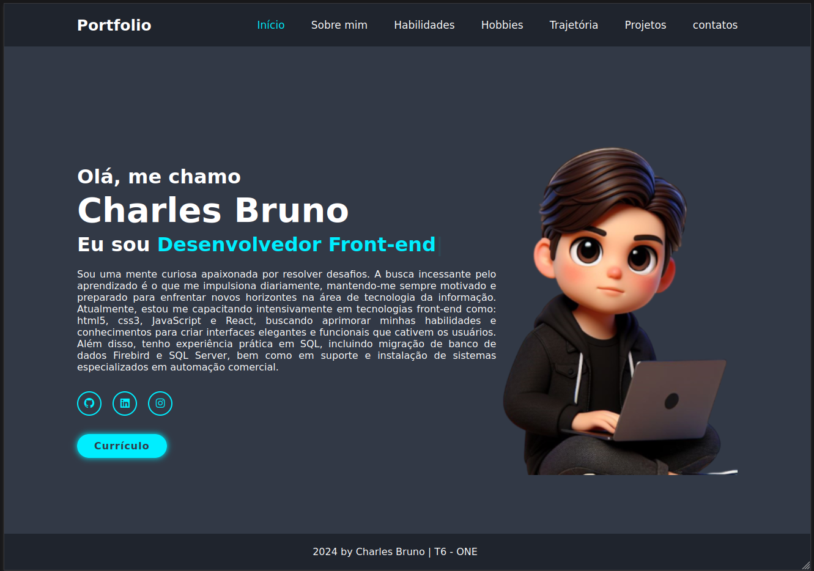

# Portfolio - #challenge ONE T6

Este projeto tem como objetivo aplicar o conhecimento adquirido através do curso da Alura e da Oracle Next One para enfrentar o desafio do Challenge 2. O desafio propôs a criação de um portfólio completo, incluindo seções como "Sobre Mim", "Hobbies", "Habilidades", "Projetos", "Educação e Formação", "Experiência Profissional" e "Contato".

O diferencial deste projeto está na busca incessante por conhecimento em diversas fontes, além do curso em andamento. A combinação de aprendizado contínuo, tanto da Alura quanto da Oracle Next One, proporcionou as habilidades necessárias para desenvolver este portfólio.

## :dizzy: Tecnologias utilizadas

<div>
  
  
  
</div>


## :computer: Visão Geral do Projeto

### Interface do Usuário 


## :mag: Demonstração

Para uma experiência completa do funcionamento do projeto, você pode acessar a demonstração interativa do Portfolio, [clique aqui.](https://charlesbrcosta.github.io/portfolio-challange/)

## :warning: Pré-requisitos

- Navegador web moderno que suporte HTML5, CSS3 e JavaScript.

## :open_file_folder: Como usar 

1. Clone o repositório:

   ```bash
   git clone https://charlesbrcosta.github.io/portfolio-challange/
   cd seu-projeto

2. Abra o arquivo index.html no seu navegador.

## :paperclip: Contribuição

1. Faça um fork do projeto.
2. Crie uma branch para a sua contribuição (git checkout -b feature/nova-funcionalidade).
3. Faça as alterações necessárias e commit (git commit -am 'Adicionando nova funcionalidade').
4. Push para a branch (git push origin feature/nova-funcionalidade).
5. Crie um novo Pull Request.

## :student: Autor

[<br><sub>Charles Bruno</sub>](https://github.com/charlesbrcosta)


## :page_facing_up: Licença

Este projeto está licenciado sob a [Licença MIT](https://www.mit.edu/~amini/LICENSE.md).